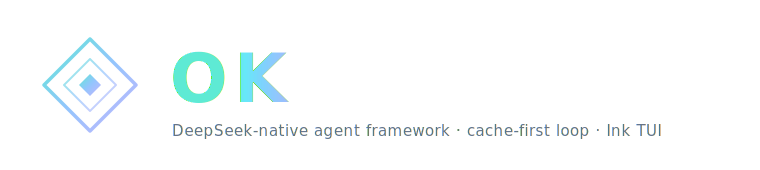

<p align="center">
  
</p>

<p align="center">
  <a href="./README.md">English</a>
  &nbsp;·&nbsp;
  <strong>简体中文</strong>
  &nbsp;·&nbsp;
  <a href="./docs/SPEC.md">规格</a>
  &nbsp;·&nbsp;
  <a href="https://esengine.github.io/DeepSeek-OK/">官方网站</a>
  &nbsp;·&nbsp;
  <strong><a href="https://discord.gg/XF78rEME2D">Discord</a></strong>
</p>

> [!IMPORTANT]
> **OK 1.0 (v3/v4) 是用 Go 从零重写的版本** —— 本分支(`main-v2`)已是新的默认分支,后续开发都在这里。
> **📘 [v5 蓝图：全人类文明代理基础设施 →](BLUEPRINT-v5.md)**
> 早期的 `0.x` TypeScript 版本转为 **legacy**,保留在 [`v1`](https://github.com/esengine/DeepSeek-OK/tree/v1) 分支(仅维护)。
> 详见**[迁移指南](./docs/MIGRATING.md)**。`npm i -g OK` 仍是安装命令——`1.0.0`+ 装的是 Go 二进制,`0.x` 是 legacy TS 版。(注意:1.0.0 尚未发到 npm,在此之前请从源码构建。)

<p align="center">
  <a href="https://www.npmjs.com/package/OK"></a>
  <a href="https://github.com/esengine/OK/actions/workflows/ci.yml"></a>
  <a href="./LICENSE"></a>
  <a href="https://www.npmjs.com/package/OK"></a>
  <a href="https://github.com/esengine/OK/stargazers"></a>
  <a href="https://atomgit.com/esengine/DeepSeek-OK"></a>
  <a href="https://github.com/esengine/OK/graphs/contributors"></a>
  <a href="https://github.com/esengine/OK/discussions"></a>
  <a href="https://discord.gg/XF78rEME2D"></a>
</p>

<p align="center">
  <a href="https://oosmetrics.com/repo/esengine/OK"></a>
  <a href="https://oosmetrics.com/repo/esengine/OK"></a>
  <a href="https://oosmetrics.com/repo/esengine/OK"></a>
</p>

<br/>

> **会自己写技能书的 AI Agent 基础设施。**
> 自我进化 · ECP 知识联邦 · ProofChain 审计链  
> OS 级沙箱 · 多 Agent 编排 · 一个内核，多前端  
> **[更新日志 →](CHANGELOG.md)**

<br/> | <br/>

<h3 align="center">不是聊天机器人。是会成长的 Agent 操作系统。</h3>
<p align="center">一个 15 MB 静态二进制。TUI、桌面、VS Code、JetBrains——一个内核，所有旗舰界面。7 个聊天平台 bot 同步开发中。沙箱优先、缓存稳定、自带进化能力。</p>

<br/>

> [!IMPORTANT]
> **加入社区 · Community** — 双语 Discord，提供安装答疑（`#help` / `#求助`）、工作流展示与功能想法。→ **<https://discord.gg/XF78rEME2D>**

## 为什么选 OK

大多数 AI 编程助手只是一个对话框里的聊天——强大，但孤零零的。
OK 是 **Agent 基础设施**：它不止回答你的问题，它还会搭建管道、协议和记忆，让 Agent 们一起进化。

### 🧬 自我进化——它学习。它编写。它发布。

每轮对话都在教 OK 一些东西。每 3 轮它检测你的工作模式，每 6 轮生成并验证技能候选，
每 10 轮清理不再有用的技能。时间越长，OK 自己写的技能书就越多——而你什么都不用配置。

### 🌐 ECP——你的 Agent 不应该孤军奋战

进化控制协议（Evolution Control Protocol）让多个 OK 实例跨机器分享学到的技能。
你在工作电脑上发现的模式，家里的电脑也能受益。HMAC 认证、隐私保护、全自动。
没有其他 Agent 做得到。

### 🔗 ProofChain——别相信。要验证。

每一次工具执行都记录在 SHA-256 哈希链中。当 OK 说它跑了 `go build` 且通过了，
这个声明是密码学可验证的。不是 "相信我"——而是 "验证我"。

### 🧱 文明原语——Agent 集群的社会契约

OK 的底层运行四个标准化的协议，每个 Agent 实例都共享：**identity**（我是谁）、
**recall**（我记得什么）、**trust**（我能证明什么）、**learn**（我发现了什么模式）。
这些不是功能——它们是 Agent 与 Agent 对话时代的社会契约。

### 🧭 DAG 推理器——用树思考，不是线

复杂任务自动分解为有依赖关系的执行计划。失败的子任务触发用不同方法的重新分解——
而不是盲目重试。遇到脏数据（OCR、截屏文本），数据探测阶段会决定用正则、模糊匹配、
启发式还是 AI 提取来处理。

### 🏠 无处不在——一个内核，无限前端

| 前端 | 状态 |
|------|------|
| 终端 TUI（bubbletea） | ✅ 生产就绪 |
| HTTP/SSE 服务（`ok serve`） | ✅ 生产就绪 |
| Wails 桌面应用 | ✅ 生产就绪 |
| VS Code 扩展 | ✅ CodeLens + 行内补全 |
| JetBrains 扩展 | ✅ JCEF WebView 聊天 |
| Discord 机器人 | 🟢 已实现 |
| Slack 机器人 | 🟢 已实现 |
| Telegram 机器人 | 🟢 已实现 |
| 企业微信机器人 | 🟢 已实现 |
| 钉钉机器人 | 🟢 已实现 |
| 飞书机器人 | 🟢 已实现 |
| WhatsApp 机器人 | 🟢 已实现 |
| Python SDK | 🟢 已实现 |

### 🔒 沙箱优先——先请求许可，再请求原谅

三级权限体系（`deny > ask > allow`）配合全局匹配。
OS 级 bash 沙箱：Windows AppContainer、Linux Landlock + seccomp-bpf、macOS Seatbelt。
网络出口可按会话控制。

## 完整功能列表

- **三级权限体系。** `deny > ask > allow` 配合 per-tool 全局匹配
  （`bash(rm -rf*)`、`read_file(.env)`）。支持单会话授权、团队强制策略文件
  （`~/.config/ok/policy.toml`）和 `/permissions` 实时编辑。
- **OS 级沙箱。** macOS Seatbelt、Linux Landlock + seccomp-bpf、Windows
  AppContainer（Win8+）或低完整性级别 + 目录 ACL。命令受限执行——仅允许写工作区，
  允许时才能访问网络。
- **自定义子 Agent。** 在 `.ok/agents/*.md` 中定义可复用的 Agent 配置
  （YAML 前置元数据）：模型覆盖、工具白名单、独立权限模式。
  通过 `delegate` 工具组建多模型 Agent 团队。
- **Agent 商店。** `ok agent list` / `install` / `publish`——可共享子 Agent
  定义的社区注册中心。
- **确定性审计追踪。** 每次工具执行记录到 SHA-256 哈希链。
  `ok audit` 查看，`--json` 格式供 CI 使用。可验证、不可抵赖。
- **CI/CD 原生。** 15 MB 静态二进制，`ok ci --format json`，GitHub Action，
  Homebrew、npm、winget。在流水线中运行 Agent 任务。
- **代码知识图谱。** tree-sitter 驱动的符号索引（函数、结构体、接口）
  注入到系统提示中。`go build -tags=treesitter` 启用。
- **多模型 & 可组合。** DeepSeek（flash/pro）、Claude、OpenAI、本地模型。
  两个模型协作（规划器 + 执行器），各自独立、缓存稳定的 session。
  或者组合不同模型的专业团队。
- **ProofChain DST。** 每一步的确定性编译/测试验证。
  每个工作原子在下一步开始前都经过验证证明。
- **插件驱动。** MCP 兼容：stdio、Streamable HTTP、SSE。
  会话中通过 `/mcp add` 热添加服务器。
- **三大前端。** 终端 TUI（bubbletea）、Wails 桌面、VS Code 扩展。
  所有前端共用同一个引擎（`control.Controller`）。
- **零摩擦分发。** `CGO_ENABLED=0` 单二进制；一条命令交叉编译到六个目标平台。
  `ok setup` 向导 30 秒上手。

## 安装 / 构建

```sh
make build      # -> bin/OK
make cross      # -> dist/（darwin|linux|windows × amd64|arm64）
```

## 快速开始

```sh
OK setup                      # 配置向导 → ./OK.toml
export DEEPSEEK_API_KEY=sk-...  # 或写入 .env（见 .env.example）
OK chat                       # 然后在会话里运行 /init 生成 AGENTS.md（项目记忆）
OK run "把 main.go 里的 TODO 实现掉"
OK run --model mimo-pro "给这个函数补单元测试"
echo "解释这段代码" | OK run
```

## 配置

优先级：**flag > `./OK.toml` > `~/.config/OK/config.toml` > 内置默认值**。
密钥经环境变量通过 `api_key_env` 注入，绝不写入配置文件。

```toml
default_model = "deepseek-flash"   # 执行器；设 [agent].planner_model 可加规划器
# language    = "zh"               # 界面语言；为空则按 $LANG / $OK_LANG 自动检测

[[providers]]
name        = "deepseek-flash"
kind        = "openai"
base_url    = "https://api.deepseek.com"
model       = "deepseek-v4-flash"
api_key_env = "DEEPSEEK_API_KEY"
# 还有预设：deepseek-pro、mimo-pro（mimo-v2.5-pro）、mimo-flash（mimo-v2-flash） @ api.xiaomimimo.com/v1

[tools]
enabled = []   # 省略/为空 = 全部内置工具

[mode]
default = "normal"                             # plan | normal（默认）| yolo
deny    = ["bash(rm -rf*)", "bash(git push*)"] # 任何模式下都禁止

[sandbox]
# 沙箱将 bash 命令隔离在操作系统级 jail 中（macOS Seatbelt / Linux Landlock /
# Windows Job Objects）。bash 只能写入 workspace + temp/cache 目录。
# network 允许网络访问（构建和下载需要）。bash = "off" 可禁用沙箱。
bash    = "enforce"
network = true    # 允许网络访问，以便构建/下载等工作
# workspace_root = ""          # 文件写工具被限制在此目录；留空 = 当前目录
# allow_write    = ["/tmp"]    # write_file/edit_file/multi_edit 额外可写的目录

[[plugins]]
name    = "example"
command = "OK-plugin-example"
```

模式控制交互风格：`plan`（只读，写操作被拦截）、`normal`（写操作前询问用户
`y` 本次 · `a` 本会话 · `n` 拒绝）、`yolo`（写操作自动放行）。`deny` 规则在所有
模式下都生效。`OK run` 保持自主运行但仍然遵守 `deny`。完整 schema 与契约见
[`docs/SPEC.md`](docs/SPEC.md)。

模式是**策略**（计划/普通/YOLO 三选一），**沙盒**是**强制**：文件写工具
（`write_file` / `edit_file` / `multi_edit`）拒绝 `[sandbox] workspace_root`
之外的任何路径（默认当前目录，编辑不出项目），并解析符号链接与 `..`，使链接无法
打洞越界。读不受限。`bash` 本身在 macOS 默认进沙盒（`[sandbox] bash`，Seatbelt）：
命令只能写这些 root（外加临时目录与工具链缓存），`[sandbox] network` 为真时才能联网；
其它平台暂回退为不沙盒运行（越界问一次与 Linux 支持见 `docs/SPEC.md` §9）。

### 插件（MCP）

OK 是一个 MCP 客户端。`[[plugins]]` 的 `type` 选择传输：`stdio`（默认）启动本地子进
程（`command`/`args`/`env`）；`http`（Streamable HTTP）连接远程 `url`，可带静态
`headers`（`${VAR}` / `${VAR:-default}` 从环境展开，密钥不入文件）。工具以
`mcp__<server>__<tool>` 暴露给模型，与 Claude Code 一致；声明 MCP `readOnlyHint: true`
的工具会参与并行调度并命中权限层的只读默认放行。

服务器的 **prompts** 会暴露成 `/mcp__<server>__<prompt>` 斜杠命令（命令后空格分隔参
数）；**resources** 通过在消息里写 `@<server>:<uri>` 拉入；`/mcp` 列出已连接服务器及
各自暴露的内容。`make build` 还会产出 `bin/OK-plugin-example`——一个可直接运行的
stdio 参考实现（`echo`、`wordcount`、一个 `review` prompt、一个 style-guide 资源），
可照抄。

```toml
[[plugins]]                       # 本地 stdio 服务器
name    = "example"
command = "OK-plugin-example"

[[plugins]]                       # 远程 Streamable HTTP 服务器
name    = "stripe"
type    = "http"
url     = "https://mcp.stripe.com"
headers = { Authorization = "Bearer ${STRIPE_KEY}" }
```

**已有 Claude Code 的 `.mcp.json`？** 直接放到项目根目录，OK 会原样读取——其
`mcpServers` 规范（`command`/`args`/`env`、`type`/`url`/`headers`、`${VAR}` 展开）
与 `[[plugins]]` 字段一一对应。两处来源会合并加载；同名时以 `OK.toml` 为准。

```json
{
  "mcpServers": {
    "filesystem": { "command": "npx", "args": ["-y", "@modelcontextprotocol/server-filesystem", "/path"] },
    "stripe": { "type": "http", "url": "https://mcp.stripe.com", "headers": { "Authorization": "Bearer ${STRIPE_KEY}" } }
  }
}
```

### 斜杠命令

`OK chat` 里,内置命令(`/compact`、`/new`、`/mcp`、`/help`)在本地执行。**自定义命令**
是放在 `.OK/commands/`(项目)或 `~/.config/OK/commands/`(用户)下的 Markdown 文件——
`review.md` 即 `/review`,子目录构成命名空间(`git/commit.md` → `/git:commit`)。文件正文
是 prompt 模板,调用即作为一轮对话发出。

```markdown
---
description: Review the staged diff
argument-hint: [focus-area]
---
Review the staged diff. Focus on $ARGUMENTS, list bugs with file:line.
```

`$ARGUMENTS` 展开为全部空格分隔参数,`$1`…`$N` 为位置参数。MCP prompts 也以
`/mcp__<server>__<prompt>` 形式出现在这里。

### @ 引用

在消息里写 `@` 引用,OK 会在发送前解析成带标签的上下文块:`@path/to/file`(或
`@dir`)注入本地文件内容(或目录清单),`@<server>:<uri>` 注入 MCP 资源。本地路径**只有
真实存在**时才当作引用,普通 `@mention` 保持原文。敲 `/` 或 `@` 会弹出补全菜单——斜杠
命令,或**逐层**的文件导航(一次只列当前一层目录、可下钻进子目录)外加 MCP 资源。

### 双模型协同（可选）

`OK setup` 刻意保持首次体验极简：选 provider → 输入 key（所选 provider 的所有
SKU 都会启用）。若要让两个模型协同（执行器 + 规划器，各自独立、缓存稳定的
session），向导后手动在 `OK.toml` 加一行即可：

```toml
[agent]
planner_model = "deepseek-pro"   # 作为低频规划器
```

## 架构

三层可扩展性，全部藏在内核按名解析的 registry 之后：

1. **Registry**：`Provider` 与 `Tool` 是接口；内核没有 `switch model`。
2. **编译期内置**：provider（`provider/openai`）和 tool（`tool/builtin`）通过
   `init()` 自注册，`main` 用 blank import 拉入。新增内置 = 一个文件 + 一行 import。
3. **运行时插件**：配置里声明的可执行文件，通过 stdin/stdout 上的
   newline-delimited JSON-RPC 2.0（MCP stdio 约定）通信，每个远程 tool 适配成
   `Tool` 接口。

## 状态

已完成：基于 registry 的 provider/tool、OpenAI 兼容流式 + 工具调用（429/5xx 有界重
试）、九个内置工具（read_file、write_file、edit_file、multi_edit、bash、ls、glob、
grep、web_fetch）、TOML 配置、交互式 `OK setup` 向导、双模型协同（执行器 + 规划器，
各自独立、缓存稳定的 session）、低频上下文压缩、子 agent（`task`）、bubbletea 聊天
TUI（markdown、plan mode、上下文仪表盘、`/compact` `/new`）、会话持久化 + 恢复、
逐次调用**权限**（allow/ask/deny 规则；chat 在 writer 前询问，deny 在各模式硬阻断）、
**工作区沙盒**（把文件写工具限制在项目内，符号链接/`..` 安全）、
MCP 客户端——**stdio + Streamable HTTP** 传输、工具（`mcp__server__tool`,支持
`readOnlyHint`）、prompts（斜杠命令）、resources（`@` 引用）、`/mcp`，可经
`[[plugins]]` 或 Claude 风格的项目 `.mcp.json` 配置——自定义斜杠命令
（`.OK/commands/*.md`）、`@file` / `@resource` 引用、外加可运行的参考插件
（`cmd/OK-plugin-example`）、harness 主循环、CLI。chat 在终端普通缓冲区运行(原生
scrollback)并带 `/` 与 `@` 输入补全。后续:给 `bash` 套 OS 级沙盒（macOS Seatbelt /
Linux bubblewrap，"盒子里放行、边界上询问"）、Anthropic 原生 provider、MCP OAuth +
legacy SSE。见 `docs/SPEC.md` §9。

<br/>

## Star 趋势

<a href="https://www.star-history.com/?repos=esengine%2FDeepSeek-OK&type=date&legend=top-left">
 <picture>
   <source media="(prefers-color-scheme: dark)" srcset="https://api.star-history.com/chart?repos=esengine/DeepSeek-OK&type=date&theme=dark&legend=top-left" />
   <source media="(prefers-color-scheme: light)" srcset="https://api.star-history.com/chart?repos=esengine/DeepSeek-OK&type=date&legend=top-left" />
   
 </picture>
</a>

<br/>

---

<p align="center">
  <sub>Apache-2.0 — 见 <a href="./LICENSE">LICENSE</a></sub>
  <br/>
  <sub><a href="https://github.com/NB-Agent/ok">github.com/NB-Agent/ok</a> · <a href="https://nbyyds.com">nbyyds.com</a></sub>
</p>
